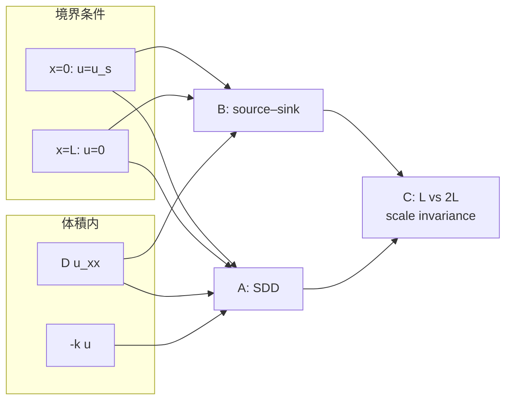

# モルフォゲン勾配（1D：SDD・source–sink・スケール不変性）

1 次元のモルフォゲン勾配を、**拡散＋分解（SDD）** と **純拡散の source–sink（両端ディリクレ）** の 2 通りで実装し、領域長 $L$ を変えたときの形状の違い（スケール不変性の有無）を比較する。

| スクリプト | モデル | 出力 |
|------------|--------|------|
| [`morphogen_gradient.py`](morphogen_gradient.py) | **SDD**：$u(0)=1$、$u(L)=0$、体積内 $-ku$ | `results/morphogen_gradient.png` |
| [`morphogen_source_sink.py`](morphogen_source_sink.py) | **Source–sink**：$u(0)=u_s$、$u(L)=0$、拡散のみ | `results/morphogen_source_sink.png` |
| [`morphogen_scale_invariance.py`](morphogen_scale_invariance.py) | 上記 2 モデルを $L$ と $2L$ で比較 | `results/morphogen_scale_invariance.png` |

**使い分けの目安**

- 発生・分子生物学の **SDD（synthesis–diffusion–degradation）** を議論するとき → **A**
- ソース／シンクを境界濃度だけで表し、**体内分解を入れない**最小モデル → **B**
- 「胚を 2 倍に伸ばしたら勾配の形は変わるか？」→ **C**（B は変わらない、A は変わる）

---

## モデルの導出（現象論）

発生生物学では、ソースから分泌された **モルフォゲン** $u$ が拡散し、標的遺伝子の発現勾配を決める。

- **仮説 A（SDD）**: 合成は $x=0$ の境界で理想化（$u=1$）、体内では Fick 拡散 $D u_{xx}$ と一次分解 $-ku$。
- **仮説 B（source–sink）**: 合成・分解を境界の固定濃度のみで表し、体内は純拡散のみ。
- **質量保存**: 定常では流入＝流出＋分解（A）または境界フラックスのみ（B）。
- 下記 §A・§B の支配方程式は、それぞれの近似から直接得られる。

## A. SDD（合成を境界で理想化）— `morphogen_gradient.py`

### 支配方程式

$$
\frac{\partial u}{\partial t} = D \frac{\partial^2 u}{\partial x^2} - k\,u,\quad x\in(0,L).
$$

境界: $u(0,t)=1$（点源）、$u(L,t)=0$（吸収端）。

発生生物学の **SDD（synthesis–diffusion–degradation）** のうち、合成を $x=0$ のディリクレ $u=1$ で表した 1D 連続近似。体積内は拡散 $D u_{xx}$ と一様分解 $-ku$ のみ。

### 定常解

$$
u(x) = \frac{\sinh\bigl(\sqrt{k/D}\,(L-x)\bigr)}{\sinh\bigl(\sqrt{k/D}\,L\bigr)}.
$$

長い系では $u(x)\approx e^{-\sqrt{k/D}\,x}$。

---

## B. Source–sink（両端ディリクレ、分解なし）— `morphogen_source_sink.py`

### 支配方程式

$$
\frac{\partial u}{\partial t} = D \frac{\partial^2 u}{\partial x^2},\quad x\in(0,L).
$$

境界: $u(0,t)=u_s$（**ソース・固定濃度**）、$u(L,t)=0$（**シンク**）。

体積内の合成項 $s(x)$ も一次分解 $-ku$ も入れない。ソースとシンクを **両方ともディリクレ境界** で表した最小モデル（純拡散による線形勾配）。

### 定常解

$$
u(x)=u_s\,\frac{L-x}{L}.
$$

### SDD（A）との違い

| | **A** `morphogen_gradient.py` | **B** `morphogen_source_sink.py` |
|--|-------------------------------|----------------------------------|
| 体積内 | $-ku$ あり | なし |
| $x=0$ | $u(0)=1$ | $u(0)=u_s$（同型） |
| $x=L$ | $u(L)=0$ | $u(L)=0$ |
| 定常形 | 指数型 $\sim e^{-\sqrt{k/D}\,x}$ | **線形** $u_s(L-x)/L$ |

---

## C. スケール不変性の比較 — `morphogen_scale_invariance.py`

### 何を示すか

[`results/morphogen_scale_invariance.png`](results/morphogen_scale_invariance.png) は **2 行 × 3 列** の図である。

| 列 | 内容 |
|----|------|
| 左・中央 | 物理座標 $x$ 上の定常 $u(x)$ を、領域長 $L=10$ と $L=20$ でそれぞれ表示 |
| 右 | 無次元座標 $\xi=x/L$ に対し、$L=10$ と $L=20$ のプロファイルを **同じ軸に重ね描き** |

- **上段（source–sink）**: $L$ を 2 倍しても $\xi$ 上では **1 本の直線** $u/u_s=1-\xi$ に重なる → **スケール不変**
- **下段（SDD）**: 同じ $(D,k)$ のまま $L$ だけ 2 倍すると、$\xi$ 上でも **曲線がずれる** → **スケール不変でない**

実線は解析的定常解、マーカーは数値定常解（陽的オイラー）。source–sink 右パネルには参照として $1-\xi$ の破線を重ねている。

### Wolpert の French Flag Problem との関係

**はい。** Lewis Wolpert は French Flag を導入したとき、パターンが **絶対サイズではなく領域の比率（proportion）で決まる** ことを要求し、これを **size invariance**（サイズ不変性）と呼んでいる（Wolpert, 1968, 1969）。フランス国旗のメタファー自体も「大きさに本質的なスケールがない」ことの例として用いられている。

1969 年の論文では **「(G) THE FRENCH FLAG PROBLEM AND SIZE INVARIANCE」** という見出しで、閾値解釈と $\alpha_i$・$\alpha_{-i}$ の和が「軸の長さ」を与える仕組みを議論している。固定勾配案（positional information の原型）では、**両端で positional value を固定する境界条件**を置けば、組織の長さ $L$ が変わってもフラッグの色の **相対的な幅**が保たれる、と述べている（Sharpe, 2019 が「French Flag *Problem*（問い）」と「*Model*（解答の一つ）」を整理）。

本デモの対応は次のとおりである。

| Wolpert の論点 | 本リポジトリの実装 |
|----------------|-------------------|
| 両端で値を固定し $L$ が変わっても **相対位置**でパターンを読む | **B** source–sink：$u(0)=u_s$, $u(L)=0$ → $u/u_s=1-\xi$ で厳密にスケール不変 |
| 体内に独立した長さスケール（拡散＋分解）がある勾配 | **A** SDD：$\alpha L=\sqrt{k/D}\,L$ が残り、$L$ だけ 2 倍すると $\xi$ 上の形が変わる |

注意: Wolpert が 1969 年に想定した「固定勾配」は、しばしば **両端の濃度（または positional value）を維持する** 条件としてスケーリングを議論しており、現代の SDD（$D,k$ 固定で $L$ だけ変える）そのものとは 1 対 1 ではない。しかし **「境界でソース／シンクを固定し、体内に長さスケールを入れない純拡散」** は、French Flag で要求された size invariance の数学的極限ケースとして **B** が示す。一方 **A** は Bicoid 型の **有限分解長** $\sqrt{D/k}$ を入れた場合で、胚サイズが変わると無次元比 $\alpha L$ が変わる、という現代的な「スケーリング問題」の例になる。

### 数学：source–sink がスケール不変な理由

定常で $D u_{xx}=0$、$u(0)=u_s$、$u(L)=0$ より

$$
u(x)=u_s\,\frac{L-x}{L}=u_s\,(1-\xi),\qquad \xi\equiv\frac{x}{L}.
$$

右辺は **$L$ が消える**。したがって $L\to\lambda L$、$x\to\lambda x$ の一様伸長（$\xi$ 固定）では $u/u_s$ は不変である。これは「長さの次元を持つパラメータが境界条件の比 $(L-x)/L$ にだけ入り、体内に長さスケールを作る反応項がない」ことと同値である。

### 数学：SDD がスケール不変でない理由

定常で $\alpha=\sqrt{k/D}$ とすると

$$
u(x)=\frac{\sinh\bigl(\alpha(L-x)\bigr)}{\sinh(\alpha L)}.
$$

無次元化 $U(\xi)=u(x)$、$\xi=x/L$ としても

$$
U(\xi)=\frac{\sinh\bigl(\alpha L(1-\xi)\bigr)}{\sinh(\alpha L)}
$$

と **無次元群 $\alpha L$** が残る。$D,k$ を固定したまま $L$ だけ 2 倍すると $\alpha L$ も 2 倍になり、同じ $\xi$ でも濃度は一般に変わる。特徴長 $\ell\sim\sqrt{D/k}$ は $L$ と独立なので、「胚の長さ」と「分解長」の比が形状を決める。

| モデル | 定常形を決める無次元量 | $L\to 2L$（$D,k$ 固定） |
|--------|------------------------|-------------------------|
| Source–sink | $\xi=x/L$ のみ | $u/u_s$ は $\xi$ で不変 |
| SDD | $\alpha L=\sqrt{k/D}\,L$ | $\alpha L$ が倍 → 勾配が「より緩やか」に |

### 生物学的な読み方（注意）

- **Source–sink（B）** は、分解を無視した極限で「端の濃度差だけが勾配を決める」理想化である。胚サイズを変えても **相対位置 $\xi$ での濃度読み出し** が不変になる、という意味でのスケール不変性を示すデモである。
- **SDD（A）** は Bicoid などで議論される、有限の分解長を持つ勾配に近い。胚が大きくなると $\alpha L$ が増え、ソース近傍の相対勾配は変わりうる（実胚では合成・分解レートも再スケールされうる点は本デモの範囲外）。

### パラメータ（`morphogen_scale_invariance.py`）

| 項目 | 既定値 | 意味 |
|------|--------|------|
| $L_0$ | 10 | 基準領域長（比較は $L_0$ と $2L_0$） |
| $D,k,u_s$ | 1, 1, 1 | 拡散・分解・ソース濃度（両モデル共通） |
| `n_steps` | $\propto (L/L_0)^2$ | 拡散時定常 $t\sim L^2/D$ に合わせて $L=20$ で 4 倍 |
| `MORPHOGEN_SCALE_QUICK=1` | — | 解析解のみで作図（テスト用・高速） |

---

## 出典（原著・標準文献）

- **Wolpert, L.** (1968). The French Flag Problem: a contribution to the discussion on pattern development and regeneration. In *Towards a Theoretical Biology* 1 (ed. C. H. Waddington), 125–133. Edinburgh Univ. Press. — French Flag **Problem** と size invariance の最初の明示的定式化。
- **Wolpert, L.** (1969). Positional information and the spatial pattern of cellular differentiation. *J. Theor. Biol.* **25**(1), 1–47. <https://doi.org/10.1016/0022-5193(69)90016-0> — 節 **(G) The French Flag Problem and Size Invariance**。
- **Sharpe, J.** (2019). Wolpert's French Flag: what's the problem? *Development* **146**, dev185967. <https://doi.org/10.1242/dev.185967> — Problem と Model の区別、境界条件によるスケーリングの読み方。
- Turing (1952). *Phil. Trans. R. Soc. B* **237**, 37–72. <https://doi.org/10.1098/rstb.1952.0012>
- Murray, J. D. *Mathematical Biology* — 拡散–分解の定常解。
- **Grimm, Coppey & Wieschaus** (2010). Modelling the Bicoid gradient. *Development* **137**, 2253–2264. <https://doi.org/10.1242/dev.032409>
- **Gregor et al.** (2007). *Cell* **130**, 153–164; 141–152.
- **Wartlick, Kicheva & González-Gaitán** (2009). *CSH Perspect. Biol.* **1**, a001255.
- **Kicheva et al.** (2012). *Curr. Opin. Genet. Dev.* **22**, 527–532.
- **Müller et al.** (2013). *Development* **140**, 1621–1638.
- **Teles et al.** (2021). *Nat. Rev. Genet.* **22**, 393–411.

**Mathematica**: [`1.1.1.MorphogenGradient.nb`](../../../../Mathematica/1_continuous_scheme/1_1_diffusion_term/morphogen_gradient/1.1.1.MorphogenGradient.nb)

## 数値計算スキーム（共通）

- 空間: 等間隔格子、内部で中心差分ラプラシアン。
- 時間: 陽的オイラー。
- 安定性: `dt <= dx^2/(2D)` を assert。
- source–sink: $u_0=u_s$、$u_n=0$ を各ステップで固定。

## パラメータ一覧

### A. `morphogen_gradient.py`

| 識別子 | 記号 | 既定値 | 意味 |
|--------|------|--------|------|
| `D` | $D$ | 1.0 | 拡散係数 |
| `k` | $k$ | 1.0 | 一次分解率 |
| `L` | $L$ | 10.0 | 領域長 |
| `n` | — | 100 | 格子数 |
| `dt` | $\Delta t$ | 0.001 | 時間刻み |
| `n_steps` | — | 5000 | ステップ数 |

### B. `morphogen_source_sink.py`（`SourceSinkParams`）

| 識別子 | 記号 | 既定値 | 意味 |
|--------|------|--------|------|
| `D`, `L` | $D$, $L$ | 1, 10 | 拡散・長さ |
| `u_source` | $u_s$ | 1.0 | ソース端の固定濃度 |
| `n` | — | 100 | 格子数 |
| `dt` | $\Delta t$ | 0.001 | 時間刻み |
| `n_steps` | — | 120000 | ステップ数（$t_{\mathrm{end}}\approx L^2/D$ 程度） |

## 実行

```bash
cd python/1_continuous_scheme/1_1_diffusion_term/morphogen_gradient
python3 morphogen_gradient.py       # → morphogen_gradient.png
python3 morphogen_source_sink.py  # → morphogen_source_sink.png
MORPHOGEN_SS_QUICK=1 python3 morphogen_source_sink.py  # 短縮（テスト用）
python3 morphogen_scale_invariance.py  # → morphogen_scale_invariance.png
MORPHOGEN_SCALE_QUICK=1 python3 morphogen_scale_invariance.py  # 解析のみ（高速）
```

## 数理解析

- **A（SDD）**: 定常解は $\sinh$ 型で厳密。`results/morphogen_gradient.png` で時間発展から定常への収束を確認。
- **B（source–sink）**: 定常解は線形 $u_s(L-x)/L$。`results/morphogen_source_sink.png` で数値解との誤差 `max|u_num-u_analytic|` を報告。
- **C（スケール比較）**: source–sink では $u(L_1,\xi)/u_s$ と $u(L_2,\xi)/u_s$ が $\xi$ 格子上で一致（数値誤差のみ）。SDD では $\alpha L$ が異なるため一致しないことを右列の重ね描きで可視化。

## 3 モデルの関係（まとめ）



- **A** = **B** + 体積内分解 $-ku$
- **C** = **A** と **B** の定常解を、$L\in\{10,20\}$ で並べ、$\xi=x/L$ への collapse の有無を比較
